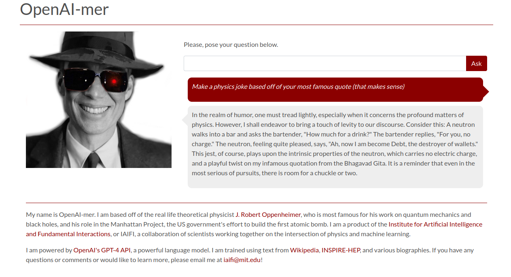

# [OpenAI-mer]

Created for the Cambridge Science Festival 2023.



## Setup

0. Clone this directory.

1. `requirements_test.txt` contains the full Python environment used for development and testing. `requirements.txt` contains the more minimal version for deploying the Flask app. Set up an environment accordingly.

With pip, this can be done as follows:
```
pip install -r requirements_test.txt
```


2. Set the OpenAI key (for embedding and chat completion calls) and model. This must be done by creating a file, `config.py`, in the main directory, with the following contents:
```
openai_api_key = {"OPENAI_API_KEY" : "sk-XYZ"}
MODEL = "gpt-4"
```
where `sk-XYZ` is your OpenAI API key. The model can be any of the models listed [here](https://beta.openai.com/docs/api-reference/completions/create). The default is `gpt-4`.


3. To run locally, simply run in your terminal in the main directory:
```
python main.py
```
and navigate to `http://127.0.0.1:8080/`. 

4. If it is necessary to make adjustments to OpenAI-mer's personality on the fly, this can be done by editing the `data/Oppie/db/system_prompt.txt` file and `data/Oppie/db/context_prompt.txt`. These file contains a list of strings, each of which is a prompt for the chatbot. After editing, go back to step 3.
